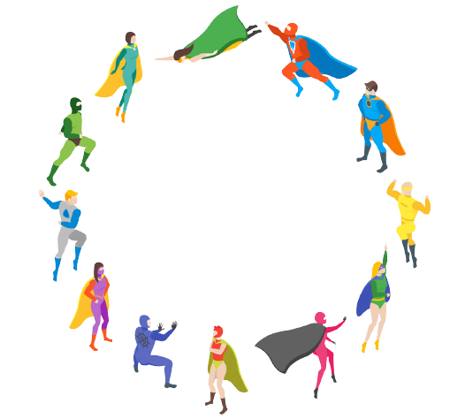

<br />
<p align="center">
  <a href="https://github.com/anesuc/superheroes">
    
  </a>

  <h3 align="center">Superhero Explorer</h3>

  <p align="center">
    For comics and superhero enthusiasts 
    <br />
    <a href="http://superheroes.veel.tv:3000/">View Demo</a>
  </p>
</p>


<!-- TABLE OF CONTENTS -->
<details open="open">
  <summary><h2 style="display: inline-block">Table of Contents</h2></summary>
  <ol>
    <li>
      <a href="#about-the-project">About The Project</a>
    </li>
    <li>
      <a href="#getting-started">Getting Started</a>
      <ul>
        <li><a href="#prerequisites">Prerequisites</a></li>
        <li><a href="#installation">Installation</a></li>
      </ul>
    </li>
    <li><a href="#usage">Usage</a></li>
  </ol>
</details>


<!-- ABOUT THE PROJECT -->
## About The Project


It is obviously easier and more convinient to use the live hosted version of this. However, if you want to run it your self locally, you can find instructions on how to do that below.


<!-- GETTING STARTED -->
## Getting Started

To get a local copy up and running follow these simple steps. Another imprtant note to coonsider is that this has been mostly tested in Chrome. There could be some issues with other browsers I am not aware of.

***You will need a local (or remote) PostgreSQL setup to connect to. Have a look at the [server.js](server file) to see how it needs to be setup. It needs to have a table named "test_db" (you can change this). The table needs to have 7 columns all set to accept intergers and the id set to be unique. The columns are to be used to store strength details of superheroes and are to be labelled as seen below:***
```
id, combat, durability, intelligence, power, speed, strength
```

### Prerequisites

* node v12.0.0+ (this will depend on your platform for how to install it).
* npm
  ```sh
  npm install npm@latest -g
  ```
* Yarn (this will depend on your platform for how to install it).

### Installation

1. Clone the repo
   ```sh
   git clone https://github.com/anesuc/superheroes.git
   ```
2. Go into the project diretory:
   ```sh
   cd superheroes
   ```
3. Install nodemon globally and the server dependencies:
   ```sh
   npm i nodemon -g
   yarn
3. Finally run it with:
   ```sh
   yarn dev
   ```


## Usage

Search in the search box for any superhero character you are interested in. It will show you suggestions as you do so as seen below:


Once you find the character you are interested in, press enter or select it from the suggestion. You will then be met with the info screen as seen below:


Alternatively, you can select previously saved superheroes to get to the same page.

You can edit statistics of a superhero by selecting the blue edit button as seen below:


